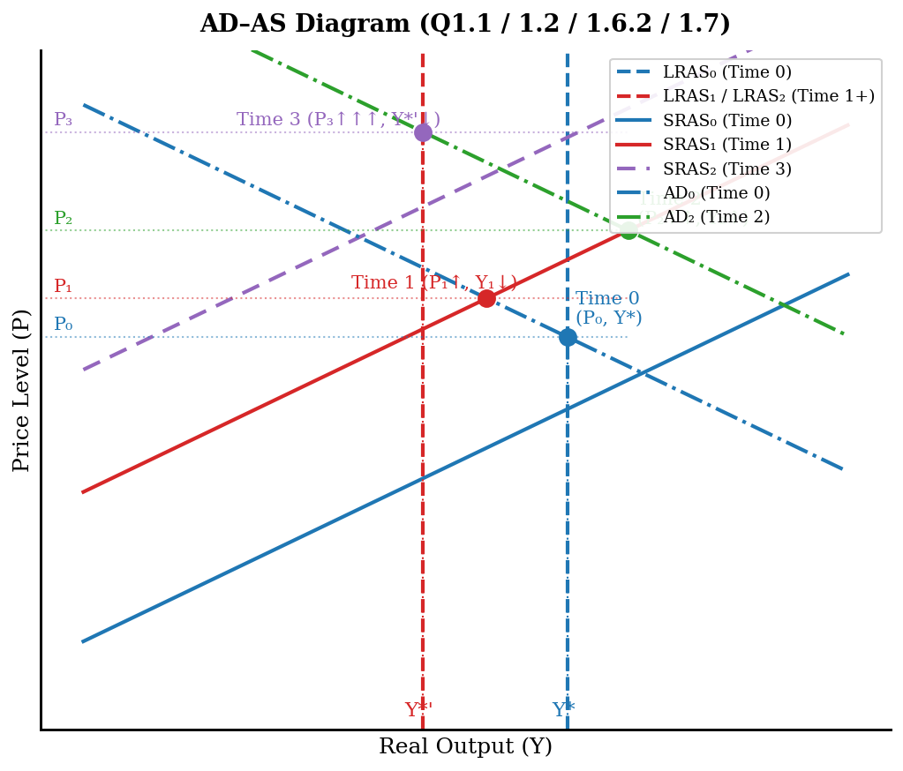
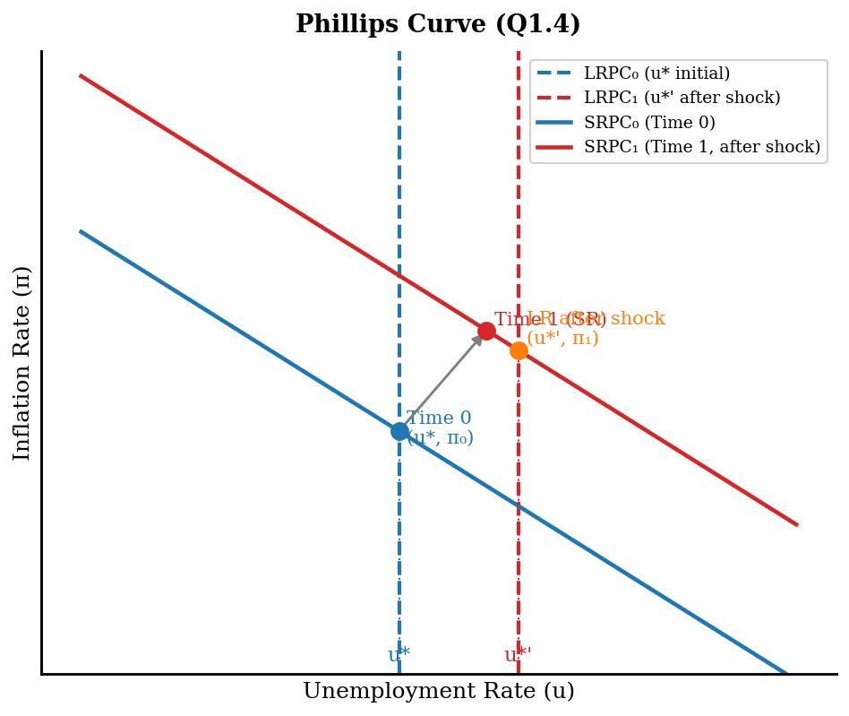
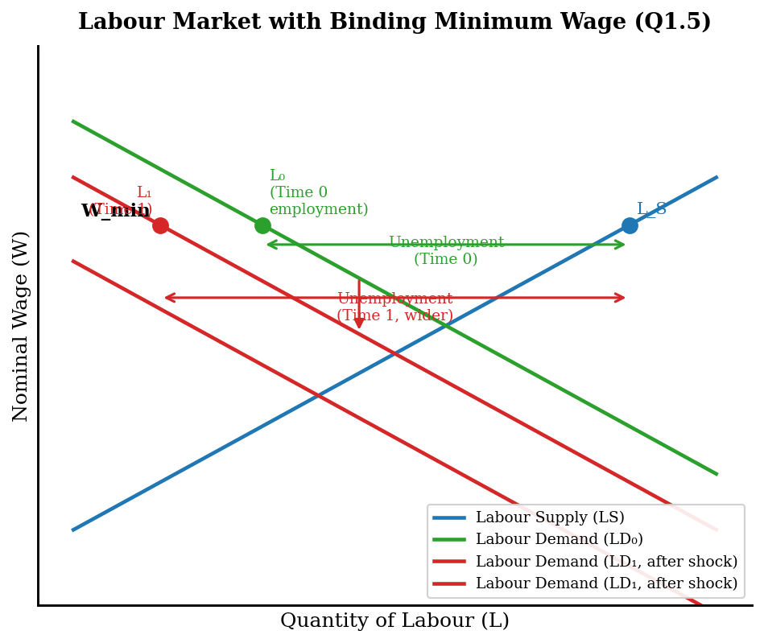
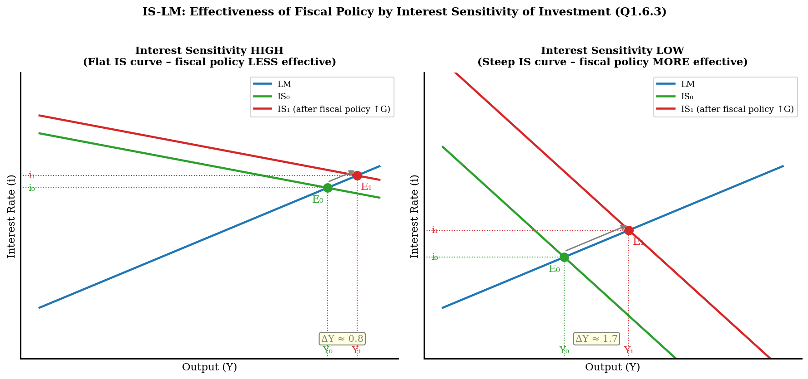
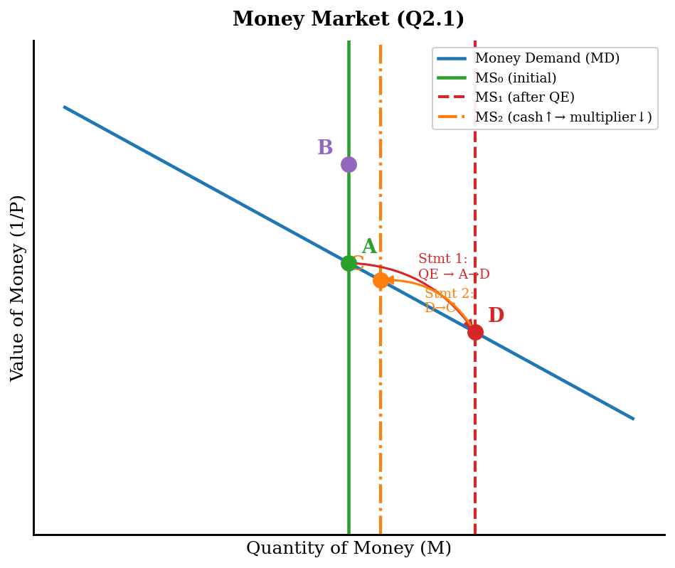

\newpage

# PART I – Case: Impact of Changes in Electricity Prices

---

## Question 1.1 – Initial Long-Run Equilibrium (Time 0)   *(0.75 p)*

In **long-run equilibrium**, actual prices equal expected prices and output equals the natural rate (Y\*). All three curves intersect at a single point **(P₀, Y\*)**.

- **LRAS** – vertical at Y\* (supply determined by real factors only)
- **SRAS₀** – upward-sloping (sticky wages in the short run)
- **AD₀** – downward-sloping (wealth + interest-rate effects)

> **Time 0** is the intersection of all three curves at (P₀, Y\*).

---

## Question 1.2 – Short-Run Impact of the Breakdown (Time 1)   *(1.5 p)*

A power-station breakdown is a **permanent adverse supply shock**: electricity is a crucial production input across all industries.

**Mechanism:**

1. Higher electricity prices → **production costs rise** for firms economy-wide.
2. Firms respond by **reducing output** and **raising prices**.
3. The **SRAS curve shifts LEFT/UPWARD** (SRAS₀ → SRAS₁) — firms supply less at every price level.
4. Because the breakdown is *permanent*, **productive capacity is permanently reduced** → **LRAS also shifts left** (Y\* → Y\*').
5. AD₀ is unchanged initially (no demand-side shock yet).

**Short-run result (Time 1):**

| Variable | Direction |
|----------|-----------|
| Output (Y) | **Falls** (Y₁ < Y\*) |
| Price level (P) | **Rises** (P₁ > P₀) |
| Unemployment | **Rises** |

This combination of falling output and rising prices is called **stagflation**.

*(See diagram above — Time 1 point is the intersection of AD₀ and SRAS₁.)*

---

## Question 1.4 – Short-Run Impact on the Phillips Curve (Time 0 → Time 1)   *(1.5 p)*

**Key points on the diagram:**

- **LRPC₀** – vertical at the initial natural unemployment rate (u\*)
- **LRPC₁** – shifts RIGHT to u\*' because the permanent breakdown raises the natural unemployment rate (lower productive capacity → fewer jobs in the long run)
- **SRPC₀** – initial short-run Phillips curve (Time 0 at u\*, π₀)
- **SRPC₁** – shifts **upward** due to the supply shock: firms face higher costs, raise prices → higher inflation at every level of unemployment
- **Time 1 (SR)** – the economy moves up and to the right along SRPC₁: **both inflation and unemployment increase** simultaneously (stagflation in Phillips curve terms)

> The supply shock is **unfavorable**: policymakers cannot reduce both inflation and unemployment at the same time. Accepting higher inflation does NOT reduce unemployment here (unlike a standard demand expansion).

---

## Question 1.5 – Labour Market with Binding Minimum Wage (Time 0 → Time 1)   *(2 p)*

**Initial situation (Time 0):**

- The minimum wage W_min is **above** the market-clearing wage → labour supply exceeds labour demand at W_min → **structural unemployment** already exists (gap between L_S and L₀).

**After the breakdown (Time 1):**

- Higher electricity costs reduce firm profitability → **firms reduce labour demand** → LD₀ shifts LEFT to LD₁.
- Wages **cannot fall below W_min** (legally binding floor) — the normal market-adjustment mechanism is blocked.
- At W_min, firms now demand even fewer workers: **L₁ < L₀**.
- Labour supply (L_S) at W_min is unchanged.
- **The unemployment gap widens**: (L_S − L₁) > (L_S − L₀).

**Conclusion:** The binding minimum wage prevents wages from falling to absorb the shock, so the entire adjustment falls on **employment** — unemployment rises more than it would in a flexible wage market.

---

## Question 1.6 – Government Policy Response

### 1.6.1 – Type of Policy   *(0.75 p)*

To keep economic activity high before elections, the government will implement:

> **Expansionary Fiscal Policy** — specifically an **increase in government spending (↑G)** and/or a **cut in taxes (↓T)**.

This directly or indirectly increases aggregate demand, partially offsetting the recession caused by the supply shock.

### 1.6.2 – Impact on the AD–AS Diagram (Time 2)   *(0.75 p)*

*(See the AD–AS diagram above — the green AD₂ curve and the green "Time 2" point.)*

- Expansionary fiscal policy shifts **AD to the right** (AD₀ → AD₂).
- Moving along SRAS₁, the new short-run equilibrium (Time 2) shows:
  - **Output rises** (Y₂ > Y₁, recovering toward Y\*')
  - **Price level rises further** (P₂ > P₁) — the stimulus adds additional inflationary pressure on top of the supply shock.

### 1.6.3 – Effectiveness Depending on Interest Sensitivity of Investment (IS-LM)   *(2 p)*

Fiscal policy (↑G) shifts the **IS curve to the right**. Higher income raises money demand → interest rate (i) rises → **private investment is crowded out**. The degree of crowding-out depends on how sensitive investment is to the interest rate.

| Sensitivity | IS slope | IS shift result | Crowding-out | Fiscal effectiveness |
|-------------|----------|-----------------|--------------|----------------------|
| **High** | Flat | Small ΔY, large Δi | **Large** | **Less effective** |
| **Low** | Steep | Large ΔY, small Δi | **Small** | **More effective** |

**Conclusion:** Fiscal policy is **most effective when the interest sensitivity of investment is LOW** (steep IS curve). In this case, even though the interest rate rises, investment barely responds, so very little of the fiscal stimulus is crowded out.

---

## Question 1.7 – Long-Run Outcome (Time 3)   *(0.75 p)*

*(See AD–AS diagram above — the purple "Time 3" point.)*

Since the breakdown is **permanent**, the long-run adjustment unfolds as follows:

1. The economy is above the new natural rate at Time 2 (output Y₂ > Y\*' and prices are rising).
2. Over time, workers and unions **update their inflation expectations upward** → they bargain for higher wages → firms face even higher costs → **SRAS continues to shift left** (SRAS₁ → SRAS₂) until it passes through the new LRAS (at Y\*').
3. Long-run equilibrium (Time 3) is where **AD₂ intersects the new LRAS** (at Y\*'):
   - **Output = Y\*'** (permanently lower than original Y\*)
   - **Price level = P₃** (significantly higher than P₀; government stimulus made it even higher)

> The government's expansionary policy **only raises prices in the long run** — it cannot permanently move output above the new natural rate Y\*'. The long-run sacrifice is both lower output (structural) and higher inflation (policy-induced).

\newpage

---

# PART II – Multiple Choice

---

## Answer Sheet

\begin{center}
\begin{tabular}{ccccc}
\toprule
\textbf{Question} & \textbf{A} & \textbf{B} & \textbf{C} & \textbf{D} \\
\midrule
2.1 & \textbf{✓} & & & \\
2.2 & & & & \textbf{✓} \\
2.3 & & & \textbf{✓} & \\
2.4 & & & \textbf{✓} & \\
2.5 & & & \textbf{✓} & \\
\bottomrule
\end{tabular}
\end{center}

---

## Question 2.1 – Money Market   **→ Answer: A (Both statements are correct)**

The diagram has **value of money (1/P)** on the vertical axis and **nominal quantity of money (M)** on the horizontal axis. The money supply (MS) is a vertical line controlled by the central bank; money demand (MD) is downward-sloping.

**Statement 1 – A → D via Quantitative Easing:**  ✓ **Correct**

Quantitative easing (QE) = the central bank purchases long-term assets from banks, **increasing the money supply**. The MS curve shifts **rightward**. The new equilibrium has *more money* and a *lower value of money* (higher price level). If D lies to the right and below A on the MD curve, this movement is consistent with QE.

**Statement 2 – D → C via increased inclination to hold cash over demand deposits:**  ✓ **Correct**

When households shift holdings from demand deposits to cash, the **currency-deposit ratio rises** → the **money multiplier falls** → the effective money supply M1 (currency + demand deposits) **contracts** → MS shifts **leftward**. The equilibrium moves to a point with *less money* and a *higher value of money*. The movement D → C (upper-left direction) is consistent with this effect.

> **Answer: A**

---

## Question 2.2 – Labour Market Statistics   **→ Answer: D**

**Calculations:**

|  | **2014** | **2015** |
|--|----------|----------|
| Working-age population (18–65) | 10,000,000 | **11,000,000** (+1M) |
| Employed | 5,000,000 | **5,000,000** (unchanged) |
| Unemployed | 1,000,000 | **2,000,000** (doubled) |
| **Labour force** | **6,000,000** | **7,000,000** |
| Not in labour force | **4,000,000** | **4,000,000** |
| **Unemployment rate** | 1/6 = **16.67%** | 2/7 = **28.57%** |
| **Employment rate** | 5/10 = **50.00%** | 5/11 = **45.45%** |
| **Labour Force Participation Rate** | 6/10 = **60.00%** | 7/11 = **63.64%** |

Checking each statement:

- **A)** Unemployment rate doubled? → doubled would be 33.33%; actual = 28.57% → **FALSE**
- **B)** Employment rate unchanged? → 50% ≠ 45.45% → **FALSE**
- **C)** People not in labour force decreased? → 4M = 4M (unchanged) → **FALSE**
- **D)** LFPR increased? → 60.00% → 63.64% → **TRUE ✓**

> **Answer: D**

---

## Question 2.3 – Before-Tax Nominal Interest Rate   **→ Answer: C (15% < x ≤ 20%)**

**Given:**

| Variable | Value |
|----------|-------|
| After-tax real interest rate | 12% |
| Inflation rate | 2% |
| Tax rate | 12.5% |

**Step 1** – Find after-tax nominal interest rate using the Fisher equation:

$$\text{After-tax nominal rate} = \text{After-tax real rate} + \text{Inflation} = 12\% + 2\% = 14\%$$

**Step 2** – Relate after-tax nominal rate to before-tax nominal rate:

$$\text{After-tax nominal rate} = x \times (1 - \text{tax rate})$$
$$14\% = x \times (1 - 0.125) = 0.875x$$

**Step 3** – Solve for x:

$$x = \frac{14\%}{0.875} = \mathbf{16\%}$$

Since $15\% < 16\% \leq 20\%$:

> **Answer: C**

---

## Question 2.4 – Trading Partner Growth   **→ Answer: C (Only Statement 2 correct)**

**Context:** Country X's main trading partner experiences strong growth → that country's income rises → it imports more from Country X → **Country X's net exports (NX) increase** → IS curve shifts right → AD increases.

**Statement 1:** *"Assume I = f(i, Y). The short-run effect of this event is theoretically ambiguous."* → **INCORRECT**

With I = f(i, Y) (investment depends on both the interest rate and income):
- NX↑ → IS shifts right → in IS-LM equilibrium: both **Y rises and i rises**
- The effect on investment *alone* is ambiguous (Y↑ raises I, but i↑ lowers I)
- However, the effect on **total output (Y)** is **unambiguously positive** — the IS shift rightward with an upward-sloping LM always yields a higher Y
- The Keynesian stability condition (ΔZ/ΔY < 1) ensures a well-defined, higher equilibrium

Statement 1 is **wrong**: the short-run effect on aggregate output is NOT ambiguous.

**Statement 2:** *"In the long run, the price level will increase more without automatic stabilizers."* → **CORRECT**

Automatic stabilizers (progressive taxation, unemployment benefits) **dampen** the AD increase:
- As income rises → taxes automatically increase, transfers decrease → AD shift is **smaller**
- Without stabilizers → the full multiplier plays out → **larger AD shift** → larger long-run price level increase

Since LRAS is vertical, a larger AD shift produces a larger price level increase in the long run. ✓

> **Answer: C**

---

## Question 2.5 – GDP Investment Component   **→ Answer: C**

The question asks which transaction affects the **Investment (I)** component of Eurozone GDP in year t.

Recall: **I = Fixed investment + Change in inventories**

| Option | Analysis | Affects I? |
|--------|----------|-----------|
| **A** British firm builds factory in London | Investment, but UK is **outside the Eurozone** — does not affect Eurozone GDP | ✗ |
| **B** Belgian buys German car (produced year t) | Both countries in Eurozone; car bought by consumer = **Consumption (C)**, not I | ✗ |
| **C** Dutch company sells carpet produced in t-1 | Carpet was produced in t-1 → counted as **inventory investment (+I) in t-1**. Selling from inventory in year t → **inventory falls → negative inventory investment (−I) in year t**. This directly affects the I component. | **✓** |
| **D** Greek resident buys old house | Old house = existing asset, not new production; sale of existing assets does **not** enter current GDP | ✗ |

Option C is the only transaction that affects the Investment (I) component of Eurozone GDP in year t — through a reduction in inventories (negative inventory investment).

> **Answer: C**

---

*End of Answers Document*
