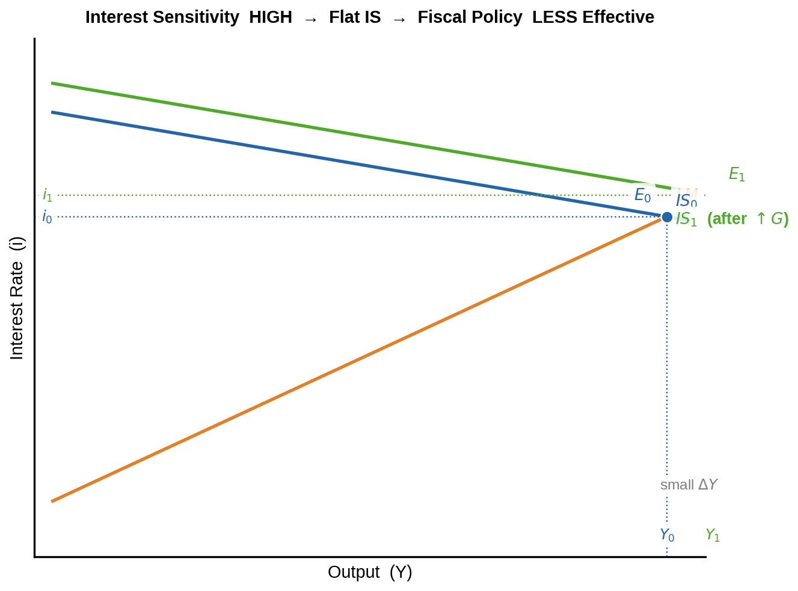
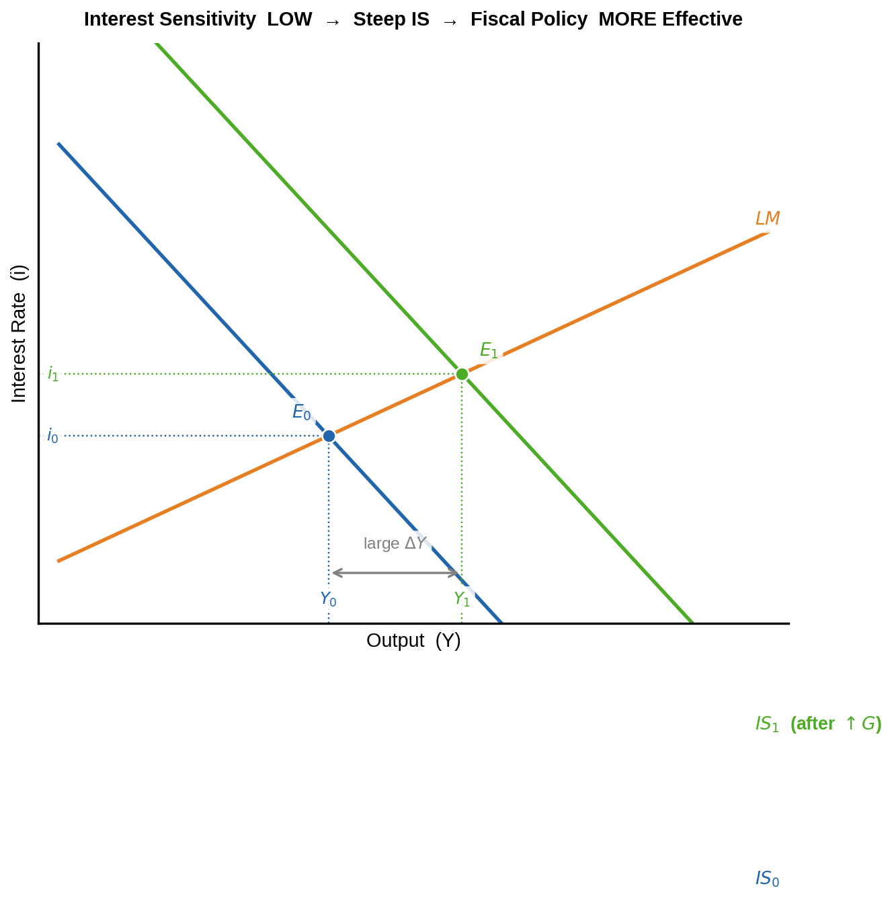

\newpage

# PART I – Case: Impact of Changes in Electricity Prices

---

## Q 1.1 – Initial Long-Run Equilibrium (Time 0)   *(0.75 p)*

In **long-run equilibrium** all three curves intersect at a single point **(P~0~, Y\*)**:
actual prices equal expected prices, output equals the natural rate, and
unemployment equals its natural rate.

- **LRAS** – vertical at Y\* (determined solely by real factors)
- **SRAS~0~** – upward-sloping (sticky wages in the short run)
- **AD~0~** – downward-sloping (wealth effect + interest-rate effect)

**Time 0** is the single intersection of all three curves in the diagram below.

---

## Q 1.2 – Short-Run Impact of the Breakdown (Time 1)   *(1.5 p)*

A permanent power-station breakdown is an **adverse supply shock**: electricity
is an essential production input across the whole economy.

**Mechanism:**

1. Higher electricity prices raise **production costs** for firms economy-wide.
2. Firms respond by **reducing output** and **raising prices**.
3. The **SRAS curve shifts left / upward** (SRAS~0~ → SRAS~1~).
4. Because the breakdown is *permanent*, productive capacity is permanently
   reduced → the **LRAS also shifts left** (Y\* → Y\*').
5. AD~0~ is unchanged at this stage (no demand-side shock yet).

| Variable | Short-run direction |
|----------|:-------------------:|
| Output (Y) | Falls  (Y~1~ < Y\*) |
| Price level (P) | Rises  (P~1~ > P~0~) |
| Unemployment | Rises |

This simultaneous fall in output and rise in prices is called **stagflation**.

---

## AD–AS Diagram (Q 1.1 / Q 1.2 / Q 1.6.2 / Q 1.7)

---

## Q 1.4 – Impact on the Phillips Curve (Time 0 → Time 1)   *(1.5 p)*

**Reading the diagram:**

| Curve / line | What it shows |
|---|---|
| **LRPC~0~** | Vertical at initial natural unemployment rate u\* |
| **LRPC~1~** | Shifts **right** to u\*' – the permanent breakdown raises the structural natural rate |
| **SRPC~0~** | Initial short-run Phillips curve; Time 0 is on this curve at (u\*, π~0~) |
| **SRPC~1~** | Shifts **upward** – higher input costs push up inflation at every unemployment level |
| **Time 1 (SR)** | Economy moves to SRPC~1~: both inflation **and** unemployment rise (stagflation) |

> The supply shock is **unfavourable**: policymakers cannot simultaneously reduce
> inflation *and* unemployment – the standard trade-off breaks down.

---

## Q 1.5 – Labour Market with Binding Minimum Wage (Time 0 → Time 1)   *(2 p)*

**Initial situation (Time 0):**

The minimum wage W~min~ already exceeds the market-clearing wage, so labour
supply exceeds demand at W~min~, creating an existing unemployment gap (L~S~ − L~0~).

**After the breakdown (Time 1):**

- Higher electricity costs reduce firm profitability → firms reduce their
  **demand for labour** → LD shifts **leftward** (LD~0~ → LD~1~).
- Because W~min~ is a legal floor, wages **cannot fall** to clear the market.
- At W~min~, firms now demand fewer workers: **L~1~ < L~0~**.
- Labour supply at W~min~ is unchanged.
- The unemployment gap **widens**: (L~S~ − L~1~) > (L~S~ − L~0~).

**Conclusion:** With a binding minimum wage the entire adjustment falls on
*employment*, not wages – unemployment rises more than in a flexible-wage economy.

---

## Q 1.6 – Government Policy Response

### Q 1.6.1 – Type of Policy   *(0.75 p)*

To keep economic activity high before elections the government will implement:

> **Expansionary Fiscal Policy** — an increase in government spending (↑G)
> and / or a cut in taxes (↓T).

This directly or indirectly raises aggregate demand, partially offsetting the
recession caused by the supply shock.

### Q 1.6.2 – Impact on the AD–AS Diagram (Time 2)   *(0.75 p)*

*(See the AD–AS diagram above — the green AD~2~ curve and the green Time 2 point.)*

Expansionary fiscal policy shifts **AD rightward** (AD~0~ → AD~2~).  
Moving along SRAS~1~, the new short-run equilibrium (Time 2) shows:

- Output **rises** (Y~2~ > Y~1~, recovering toward Y\*')
- Price level **rises further** (P~2~ > P~1~) — the stimulus adds inflationary
  pressure on top of the supply shock.

### Q 1.6.3 – IS-LM: Fiscal Policy Effectiveness by Interest Sensitivity   *(2 p)*

Fiscal policy (↑G) shifts the **IS curve rightward**.  Higher income raises
money demand → the interest rate (i) rises → private investment is **crowded
out**. The degree of crowding-out depends on how sensitive investment is to the
interest rate.

**When sensitivity is HIGH (flat IS):**

A small rise in *i* causes a large fall in *I* → **large crowding-out → small
ΔY** → fiscal policy is **less effective**.

**When sensitivity is LOW (steep IS):**

A large rise in *i* causes only a small fall in *I* → **little crowding-out →
large ΔY** → fiscal policy is **more effective**.

| Interest sensitivity | IS slope | Crowding-out | Fiscal effectiveness |
|---|---|---|---|
| High | Flat | Large | Less effective |
| **Low** | **Steep** | **Small** | **More effective** ✓ |

---

## Q 1.7 – Long-Run Outcome (Time 3)   *(0.75 p)*

*(See the AD–AS diagram above — the purple Time 3 point.)*

Because the breakdown is **permanent** the long-run adjustment unfolds as follows:

1. At Time 2 output (Y~2~) exceeds the new natural rate (Y\*') → upward wage
   and price pressure builds.
2. Workers update their inflation expectations upward → higher wages → higher
   costs → **SRAS continues shifting left** (SRAS~1~ → SRAS~2~) until it
   intersects the new LRAS at Y\*'.
3. Long-run equilibrium (Time 3) is where **AD~2~ meets the new LRAS**:
   - Output = **Y\*'** (permanently lower than the original Y\*)
   - Price level = **P~3~** (substantially higher than P~0~)

> The government stimulus **only raises prices in the long run** — output cannot
> be permanently kept above the new natural rate.  
> The long-run cost: lower structural output *and* higher inflation.

\newpage

---

# PART II – Multiple Choice

---

## Answer Sheet

\begin{center}
\renewcommand{\arraystretch}{1.6}
\begin{tabular}{lcccc}
\toprule
\textbf{Question} & \textbf{A} & \textbf{B} & \textbf{C} & \textbf{D} \\
\midrule
2.1 & \textbf{A} & & & \\
2.2 & & & & \textbf{D} \\
2.3 & & & \textbf{C} & \\
2.4 & & & \textbf{C} & \\
2.5 & & & \textbf{C} & \\
\bottomrule
\end{tabular}
\end{center}

---

## Q 2.1 – Money Market   **Answer: A — Both statements are correct**

**Statement 1 – A → D via Quantitative Easing:**   **Correct** ✓

QE = the central bank buys long-term assets from banks, **increasing the money
supply**. The vertical MS curve shifts **rightward** (MS~0~ → MS~1~). The new
equilibrium D has *more money* and a *lower value of money* (higher price level),
which is consistent with the movement A → D.

**Statement 2 – D → C via increased inclination to hold cash over deposits:**   **Correct** ✓

When households shift from demand deposits to cash, the **currency-deposit
ratio rises** → the **money multiplier falls** → the effective money supply M1
**(currency + demand deposits) contracts** → MS shifts **leftward** (MS~1~ →
MS~2~). The equilibrium moves to *less money* and a *higher value of money*,
consistent with the movement D → C.

---

## Q 2.2 – Labour Market Statistics   **Answer: D**

| | 2014 | 2015 |
|---|---|---|
| Working-age population (18–65) | 10 000 000 | **11 000 000** (+1M) |
| Employed | 5 000 000 | **5 000 000** (unchanged) |
| Unemployed | 1 000 000 | **2 000 000** (doubled) |
| **Labour force** | **6 000 000** | **7 000 000** |
| Not in labour force | **4 000 000** | **4 000 000** |
| **Unemployment rate** | 1/6 = **16.67 %** | 2/7 = **28.57 %** |
| **Employment rate** | 5/10 = **50.00 %** | 5/11 = **45.45 %** |
| **Labour Force Participation Rate** | 6/10 = **60.00 %** | 7/11 = **63.64 %** |

- **A** – Unemployment rate doubled? Doubled would be 33.33 %; actual is 28.57 % → **False**
- **B** – Employment rate unchanged? 50.00 % ≠ 45.45 % → **False**
- **C** – Not-in-labour-force decreased? 4 M = 4 M (unchanged) → **False**
- **D** – LFPR increased? 60.00 % → 63.64 % → **True** ✓

---

## Q 2.3 – Before-Tax Nominal Interest Rate   **Answer: C (15 % < x ≤ 20 %)**

| Given | Value |
|---|---|
| After-tax real interest rate | 12 % |
| Inflation rate | 2 % |
| Tax rate | 12.5 % |

**Step 1 — Fisher equation (after-tax):**

$$\text{After-tax nominal rate} = 12\% + 2\% = 14\%$$

**Step 2 — Apply tax:**

$$14\% = x \times (1 - 0.125) = 0.875\,x$$

**Step 3 — Solve:**

$$x = \frac{14\%}{0.875} = \mathbf{16\%}$$

Since 15 % < 16 % ≤ 20 %: **Answer C**.

---

## Q 2.4 – Trading Partner Growth   **Answer: C — Only Statement 2 is correct**

**Context:** Trading partner's growth raises its income → it imports more from
country X → **X's exports rise → NX↑ → IS shifts right → AD increases**.

**Statement 1:** *"Assume I = f(i, Y).  The short-run effect is theoretically ambiguous."* — **Incorrect**

With I = f(i, Y) the IS-LM equilibrium still gives a unique, higher output Y:

- NX↑ shifts IS right → new IS-LM intersection has higher Y *and* higher i.
- Higher i lowers I (negative), higher Y raises I (positive via accelerator).
- The effect on *investment alone* is ambiguous, but the effect on **total output
  (Y)** is unambiguously positive — the IS shift rightward with an upward-sloping
  LM always produces a higher equilibrium Y.

Statement 1 is **wrong**.

**Statement 2:** *"Price level rises more in the long run without automatic
stabilizers."* — **Correct** ✓

Automatic stabilizers (progressive taxes, unemployment benefits) dampen the AD
increase: as income rises, taxes automatically rise and transfers fall → smaller
net AD shift → smaller long-run price increase.  
Without stabilizers the full multiplier operates → larger AD shift → larger
long-run price level increase (LRAS is vertical, so all extra AD shows up as
higher P in the long run).

---

## Q 2.5 – GDP Investment Component   **Answer: C**

Recall: **I = Fixed investment + Change in inventories**

| Option | Analysis | Affects I in Eurozone year t? |
|---|---|:---:|
| **A** British firm builds factory in London | New factory = investment, but the UK is **outside the Eurozone** | No |
| **B** Belgian buys German car (produced year t) | Both in Eurozone; car purchased by consumer = **Consumption (C)** | No |
| **C** Dutch company sells carpet produced in year t-1 | Carpet entered inventory as **+I in t-1**; selling it from inventory in year t = **inventory drawdown → negative I in year t** | **Yes** ✓ |
| **D** Greek resident buys old house | Existing asset; sale of old assets is not new production → does not enter current GDP | No |

Option C is the only transaction that directly affects the Investment component
of Eurozone GDP in year t — through a **reduction in inventories** (negative
inventory investment).

---

*End of Answers*
